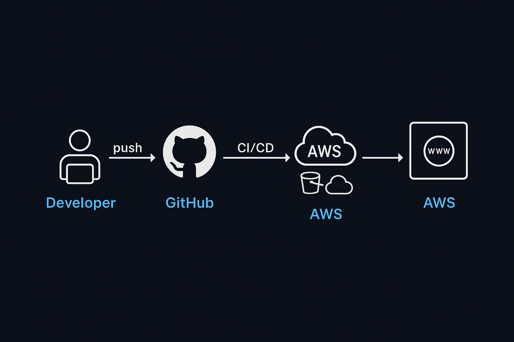

## 🚀 Cloud Portfolio Deployment Pipeline

This project showcases a **full CI/CD pipeline** deploying my portfolio website to both **AWS S3 + CloudFront** (production-grade hosting with HTTPS) and **GitHub Pages** (permanent free backup).  

### Key Highlights
- **Cloud Skills:** AWS S3 (static hosting), AWS CloudFront (CDN + HTTPS), IAM (secure access)
- **DevOps Skills:** GitHub Actions CI/CD workflow, automatic deployment on push to `main`
- **Version Control:** Git as a single source of truth for both AWS & GitHub Pages
- **Professional Touch:** CloudFront cache invalidation for instant updates

Whenever I push changes to the `main` branch, GitHub Actions automatically:
1. Updates GitHub Pages.
2. Syncs files to AWS S3.
3. Invalidates CloudFront cache for instant content refresh worldwide.

---

## 📌 Architecture Diagram

